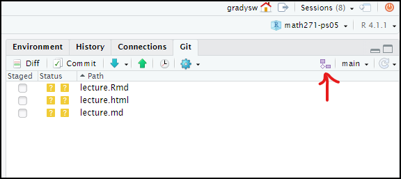

```{r setup, include=FALSE, message=FALSE, warning=FALSE}
knitr::opts_chunk$set(echo = TRUE)
library(tidyverse)
library(nycflights13)
```

### Flights data sets

The `nycflights13` package has five interrelated data sets

- `nycflights13::flights` information about individual flights (340k rows)
- `nycflights13::airports` information about airports (1.5k rows)
- `nycflights13::airlines` information about airlines (16 rows)
- `nycflights13::planes` information about individual aircraft (3.3k rows)
- `nycflights13::weather` airport weather station records (26k rows)

It is generally a good idea to store information about different types of subjects in different data sets, as is done here, and then merge the information when needed later.


```{r}
(flights100 <- flights %>% slice_sample(n=500))
```

## Joins

`dplyr::left_join` and friends `right_`, `inner_` and  `full_` allow you to grab information from another data set and join it into new columns of a starting data set. You will almost always want `left_join`, or possibly `inner_join`.

Both the `flights` and `airlines` data have a `carrier` column. Use the `carrier` columns to get the matching `airlines$name` and add it to the incoming data.
```{r}
flights100 %>% select(carrier:dest) %>% left_join(airlines, by="carrier")
```
If a vector of variable names is supplied as the matching key, all of the values are compared when looking for matches.


Joining weather information at the departure airport to the flight information. Note that variable names

```{r}
flights100 %>%
  inner_join(weather, by=c("year","month","day","hour","origin"))
  
```

If a _named vector_ can be supplied to `by`, `"left_name"="right_name"`, if the key matching variables have different names in the two data sets. This adds the name of the destination airport by using the flight `dest` to match the `faa` column in the `airports` data.

```{r}
flights100 %>% left_join(airports, by=c("dest"="faa"))
```

### Filtering joins

The commands `semi_join` and `anti_join` don't add columns from the second data set, but only filter the incoming data set and return only rows that have/don't have matches.

Here we first keep only flights where the tail number appears in the `planes` data, and then keep only flights where the tail number does not appear.
```{r}
dim(flights)
flights %>% semi_join(planes, "tailnum") %>% dim 
flights %>% anti_join(planes, "tailnum") %>% dim
```


## Git branches

Git is an incredibly powerful tool, and there are multiple systems that people have developed for using it in a team setting, but all revolve around the idea of _branches_. So far we've worked mostly only on a `master` or `main` branch (although we've encountered branches before in the `feedback` on Github, and when we merged the `grady` branch autograder fixes into PS02.)

- Create a new branch in RStudio. Give it a simple one word name (such as your first name). When successful the label next to the new branch button should indicate you are on the new branch.



- Make a change to a file and commit to your new branch.
- Push your new branch up to github and check that it shows up there.

- https://learngitbranching.js.org/
- Do the Introduction Sequence levels `intro1` through `intro4` (in class), the Ramping Up levels, particularly `rampup4`, and from the Remote tab all Push & Pull lessons, `remote1` through `remote8`.
- We will carry out most of the git commands in these tutorial lessons, but we will do it using RStudio and Github instead of the terminal. 